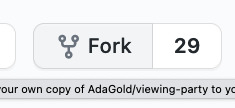
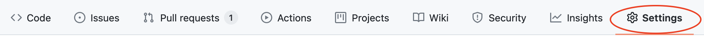
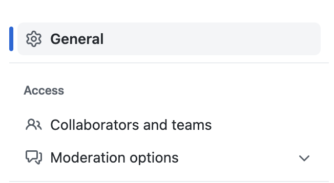
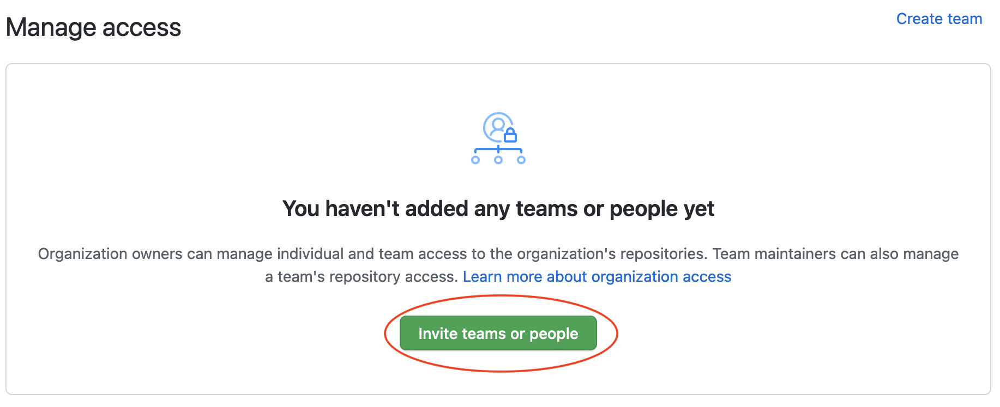

# Viewing Party

## Skills Assessed

Solving problems with...

- Conditional logic
- Lists
- Dictionaries
- Nested loops
- Nested data structures
- Pair-programming techniques

## Goal

You and your friends enjoy watching things together online. Of course, everyone has seen different things, has different favorites, and different things they want to watch.

You've been using a spreadsheet to compare everyone's watched list, favorites list, and watchlist, but it's been getting too cumbersome. In order to find things you've watched and your friends haven't watched, or things that your friends have watched and you haven't watched, you have to comb through the spreadsheet. You know that there are different ways we can get that information: we can use Python!

For this project, you and your partner will be given some data structure that represents the things you've watched, favorited, and want to watch. The directions below will lead you and your partner to create a series of functions. These functions will modify the data, and implement features like adding and removing things between different lists. Other features include creating recommendations!

## Pair Programming

Utilize good pair programming practices. Refer to this [medium article](https://medium.com/@weblab_tech/pair-programming-guide-a76ca43ff389), and the lesson in Learn titled Intro to Pair Programming from Approaching a Problem if you need a refresher for some best practices. Switch _driver_ and _navigator_ roles often. When there is uncertainty or confusion, step away from the keyboard and discuss, plan, and document on paper or whiteboard before continuing.

## One-Time Project Setup

Follow these directions once, at the beginning of your project:

*Only one member of the team should complete the following two steps:*

1. In GitHub, click on the "Fork" button and fork the repository to your GitHub account.  This will make a copy of the project in your GitHub account. 



2. In Github, add the other member(s) of your team as collaborators to the repository. The student who forked the respository should do this by first choosing **Settings** from the top menu bar, then choosing **Collaborators** from the navigation bar on the left, and finally selecting the green **Add People** button.

You can find detailed instructions [here](https://help.github.com/articles/inviting-collaborators-to-a-personal-repository/).







The invited member(s) will need to accept the invitation either by accepting the email invitation or accepting the invitation in Github.

Both members of the team will be working from the same forked repository.  Be sure to follow proper git protocol from the Intro to Git topic in Learn.

*Each member of the pair should complete the following steps:*

3. Navigate to your projects folder which is named `projects`. 

If you followed Ada's recommended file system structure from the Intro to Dev Environment lesson in Learn, you can navigate to your projects folder with the following command:

```bash
$ cd ~/Developer/projects
```

4. "Clone" (download a copy of this project) into your projects folder. This command makes a new folder called `viewing-party`, and then puts the project into this new folder.  Make sure you are cloning from your copy of the project and not the class version (ada-cX).

```bash
$ git clone ...
```

Use `ls` to confirm there's a new project folder

5. Move your location into this project folder

```bash
$ cd viewing-party
```

6. Create a virtual environment named `venv` for this project:

```bash
$ python3 -m venv venv
```

7. Activate this environment:

```bash
$ source venv/bin/activate
```

Verify that you're in a python3 virtual environment by running:

- `$ python --version` should output a Python 3 version
- `$ pip --version` should output that it is working with Python 3

8. Install dependencies once at the beginning of this project with

```bash
# Must be in activated virtual environment
$ pip install -r requirements.txt
```

Summary of one-time project setup:
One person:
- [ ] Fork the project respository
- [ ] Invite team members to the respository

All team members:
- [ ] `cd` into your `projects` folder
- [ ] Clone the project onto your machine
- [ ] `cd` into the `viewing-party` folder
- [ ] Create the virtual environment `venv`
- [ ] Activate the virtual environment `venv`
- [ ] Install the dependencies with `pip`

## Project Development Workflow

We will use a Test Driven Development programming workflow to work on this project.

1. When you want to begin work on this project, ensure that your virtual environment is activated:

```bash
$ source venv/bin/activate
```

2. Check the `tests` folder, and find the test file you want to run

   - In that test file, read through each test case
      - If it is incomplete, complete the test. 
        - *Is this a nominal or edge case?*
        - *What type of input do we need to test this case?*
        - *What is the expected output for the given input?*
   - Remove the lines that contain `@pytest.mark.skip()` for the test(s) you want to run.

3. Run the test(s)!
    - *See the [Details About How to Run Tests](#details-about-how-to-run-tests) section below for more information on how to run test(s).*

```bash
# Must be in activated virtual environment in the project-root directory
$ pytest
```

4. Read through the test failure, and understand why the failure is happening. Confirm your findings with your partner. 
    - If it is a test you wrote, consider whether you are actually testing what you intend to test. Does the test need modification?

5. Make a plan with your partner to implement code to pass the test.

6. Write code in `party.py` to pass the test.

7. Re-run the tests.

8. Repeat steps 3-7 until that test passes!

9. Repeat steps 2-8 until you have finished all tests in the file. Consider switching driver/navigator roles. Make sure the current driver pushes using `git push` and the new driver pulls using `git pull`.

10. Consider looking for opportunities with your partner to improve your code.

11. Before moving to the next wave, make sure you haven't missed any skipped tests.
      - *Search the file (**Cmd** **F**) for `@pytest.mark.skip`*
      - *To search all files in the project, use **Cmd** **Shift** **F***

12. Begin using the test file of the next wave!

13. When you are finished working for the day, deactivate your environment with deactivate or by closing the Terminal tab/window

```bash
$ deactivate
```

Finally, at submission time, **no matter where you are**, submit the project via Learn.

In addition to submitting your Pull Request, submit a reflection to the pair programming reflection prompt.

## Details About How to Run Tests

All the commands described below should be run from the project-root directory `viewing-party`. Note that the project-root directory is the repository `viewing-party`. It is distinct from the directory `viewing_party` that contains the source code in `party.py`.

To run all unskipped tests that exist in this project with:

```bash
# Must be in activated virtual environment
$ pytest
```

To see any `print` statement's output in the console, add `-s` to the end of any `pytest` command:

```bash
# Must be in activated virtual environment
$ pytest -s
```

To run all unskipped tests that exist in one file, use:

```bash
# Must be in activated virtual environment
$ pytest tests/test_file_name.py
```

... where `test_file_name.py` is replaced with the correct test file name.

To run a single test by name:

```bash
# Must be in activated virtual environment
$ pytest tests/test_file_name.py::test_name
```

... where `test_name.py` is relpaced with the name of the function.

## Play Testing

While we will mainly use a Test Driven Development (TDD) workflow for this project, it can be helpful to run code independently from running tests. To do this, a file `play_tester.py` is provided.

To run this file, use:

```bash
# Must be in activated virtual environment in the project root-directory
python3 play_tester.py
```

There is some starter code provided in `play_tester.py`. This code prints the test data that is used for many of the tests. Looking closely at this data can help us think critically about the expected output for given input for each function. Then, calling each function with this data allows us to observe the **actual** output for given input. 

## Test Data

We will note that much of the test data for this project is provided by the file `test_constants.py`. As test data gets more and more complex, it is helpful to organize this data in its own file to enhance consistency and readability. Pytest, like many testing libraries, provide a special too for test data called **fixtures**. We will learn about fixtures later in the curriculum. 

For the time being, we need to make sure that the data provided to each test is clean and free of any changes that running another test may have introduced. Recall the *Modifying Mutable Objects* section of the *Variables Are References lesson.* To ensure that the data for each test is storied in a unique place in memory, there are functions implemented in `test_constants.py` that provide clean test data (i.e. `clean_wave_3_data`) by using `copy.deepcopy`. 

## Project Directions

### Set Up a Pair Plan

First, come up with a "plan of action" for how you want to work as a pair. Discuss your learning style, how you prefer to receive feedback, and one team communication skill you want to improve with this experience.

We recommend spending at least a portion of the time pair programming and working collaboratively from the same machine.  Zoom and screen sharing or [VSCode Live Share](https://code.visualstudio.com/learn/collaboration/live-share) are good tools to consider.  Some teams will choose to pair program and work collaboratively from the same machine for the entire project.  Some teams will choose to divide a portion of the work and combine their code using git.

This project is designed such that one could puzzle together how to implement this project without many directions. Being able to read tests to understand what is expected of our program is a skill that needs to be developed; programmers often take years to develop this skill competently.

When our test failures leave us confused and stuck, let's use the detailed project requirements below.

### Wave 1

1. Create a function named  `create_movie`. This function and all subsequent functions should be in `party.py`. `create_movie` should...

- take three parameters: `title`, `genre`, `rating`
- If those three attributes are truthy, then return a dictionary. This dictionary should...
  - Have three key-value pairs, with specific keys
  - The three keys should be `"title"`, `"genre"`, and `"rating"`
  - The values of these key-value pairs should be appropriate values
- If `title` is falsy, `genre` is falsy, or `rating` is falsy, this function should return `None`

2. Create a function named `add_to_watched`. This function should...

- take two parameters: `user_data`, `movie`
  - the value of `user_data` will be a dictionary with a key `"watched"`, and a value which is a list of dictionaries representing the movies the user has watched
    - An empty list represents that the user has no movies in their watched list
  - the value of `movie` will be a dictionary in this format:
    - ```python
      {
        "title": "Title A",
        "genre": "Horror",
        "rating": 3.5
      }
      ```
- add the `movie` to the `"watched"` list inside of `user_data`
- return the `user_data`

3. Create a function named `add_to_watchlist`. This function should...

- take two parameters: `user_data`, `movie`
  - the value of `user_data` will be a dictionary with a key `"watchlist"`, and a value which is a list of dictionaries representing the movies the user wants to watch
    - An empty list represents that the user has no movies in their watchlist
  - the value of `movie` will be a dictionary in this format:
    - ```python
      {
        "title": "Title A",
        "genre": "Horror",
        "rating": 3.5
      }
      ```
- add the `movie` to the `"watchlist"` list inside of `user_data`
- return the `user_data`

4. Create a function named `watch_movie`. This function should...

- take two parameters: `user_data`, `title`
  - the value of `user_data` will be a dictionary with a `"watchlist"` and a `"watched"`
    - This represents that the user has a watchlist and a list of watched movies
  - the value of `title` will be a string
    - This represents the title of the movie the user has watched
- If the title is in a movie in the user's watchlist:
  - remove that movie from the watchlist
  - add that movie to watched
  - return the `user_data`
- If the title is not a movie in the user's watchlist:
  - return the `user_data`

Note: For Waves 2, 3, 4, and 5, your implementation of each of the functions should not modify `user_data`.

### Wave 2

1. Create a function named `get_watched_avg_rating`. This function should...

- take one parameter: `user_data`
  - the value of `user_data` will be a dictionary with a `"watched"` list of movie dictionaries
    - This represents that the user has a list of watched movies
- Calculate the average rating of all movies in the watched list
  - The average rating of an empty watched list is `0.0`
- return the average rating

2. Create a function named `get_most_watched_genre`. This function should...

- take one parameter: `user_data`
  - the value of `user_data` will be a dictionary with a `"watched"` list of movie dictionaries. Each movie dictionary has a key `"genre"`.
    - This represents that the user has a list of watched movies. Each watched movie has a genre.
    - The values of `"genre"` is a string.
- Determine which genre is most frequently occurring in the watched list
- return the genre that is the most frequently watched
- If the value of "watched" is an empty list, `get_most_watched_genre` should return `None`.

### Wave 3

1. Create a function named `get_unique_watched`. This function should...

- take one parameter: `user_data`
  - the value of `user_data` will be a dictionary with a `"watched"` list of movie dictionaries, and a `"friends"`
    - This represents that the user has a list of watched movies and a list of friends
    - The value of `"friends"` is a list
    - Each item in `"friends"` is a dictionary. This dictionary has a key `"watched"`, which has a list of movie dictionaries.
    - Each movie dictionary has a `"title"`.
- Consider the movies that the user has watched, and consider the movies that their friends have watched. Determine which movies the user has watched, but none of their friends have watched.
- Return a list of dictionaries, that represents a list of movies

2. Create a function named `get_friends_unique_watched`. This function should...

- take one parameter: `user_data`
  - the value of `user_data` will be a dictionary with a `"watched"` list of movie dictionaries, and a `"friends"`
    - This represents that the user has a list of watched movies and a list of friends
    - The value of `"friends"` is a list
    - Each item in `"friends"` is a dictionary. This dictionary has a key `"watched"`, which has a list of movie dictionaries.
    - Each movie dictionary has a `"title"`.
- Consider the movies that the user has watched, and consider the movies that their friends have watched. Determine which movies at least one of the user's friends have watched, but the user has not watched.
- Return a list of dictionaries, that represents a list of movies

### Wave 4

1. Create a function named `get_available_recs`. This function should...

- take one parameter: `user_data`
  - `user_data` will have a field `"subscriptions"`. The value of `"subscriptions"` is a list of strings
    - This represents the names of streaming services that the user has access to
    - Each friend in `"friends"` has a watched list. Each movie in the watched list has a `"host"`, which is a string that says what streaming service it's hosted on
- Determine a list of recommended movies. A movie should be added to this list if and only if:
  - The user has not watched it
  - At least one of the user's friends has watched
  - The `"host"` of the movie is a service that is in the user's `"subscriptions"`
- Return the list of recommended movies

### Wave 5

1. Create a function named  `get_new_rec_by_genre`. This function should...

- take one parameter: `user_data`
- Consider the user's most frequently watched genre. Then, determine a list of recommended movies. A movie should be added to this list if and only if:
  - The user has not watched it
  - At least one of the user's friends has watched
  - The `"genre"` of the movie is the same as the user's most frequent genre
- Return the list of recommended movies

2. Create a function named  `get_rec_from_favorites`. This function should...

- take one parameter: `user_data`
  - `user_data` will have a field `"favorites"`. The value of `"favorites"` is a list of movie dictionaries
    - This represents the user's favorite movies
- Determine a list of recommended movies. A movie should be added to this list if and only if:
  - The movie is in the user's `"favorites"`
  - None of the user's friends have watched it
- Return the list of recommended movies
